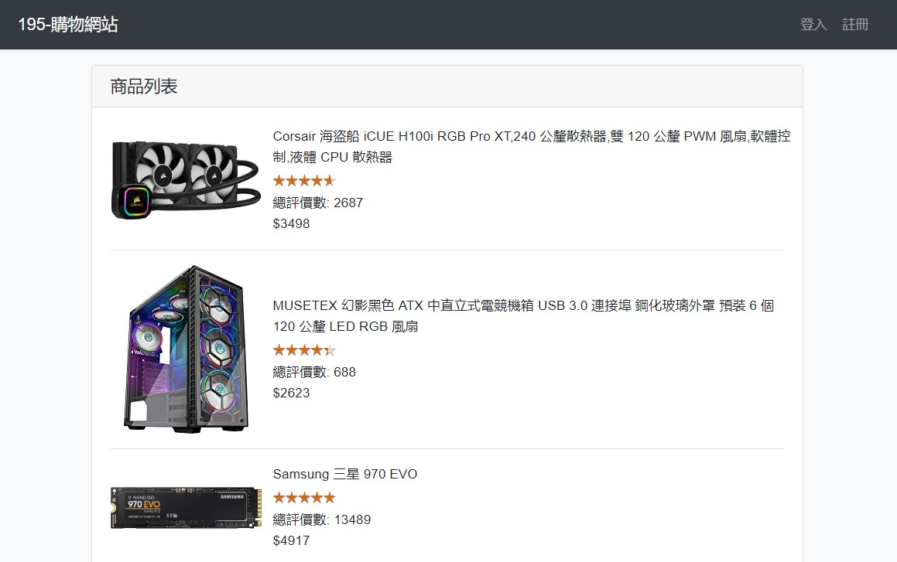

# 195-購物網站 首頁


# 安裝

### 1. 安裝相關套件
```
composer install
```

### 2. 編譯前端(CSS & JS)套件
```
npm install
npm run dev
```

### 3. 配置 Homestead.yaml 與 .env
```
make init
make
```
或手動配置
```
cp .env.example .env (視需求設定DB資料庫名稱、帳密)
php ./vendor/bin/homestead make
Homestead.yaml add php:"7.4" at sites
vagrant up
```

### 4. vagrant 生成金鑰、資料庫遷移、產生測試資料
```
vagrant ssh
cd code
php74
php artisan key:generate
php artisan migrate
php artisan db:seed
```

